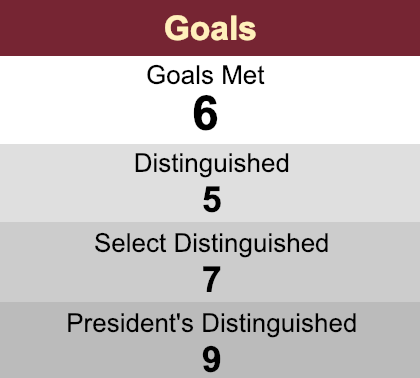

# President Team

## Responsibility 

They set the tone for the club and provide a helpful, supportive leadership for all the club activities 

## Activities

* New Officer Installation
* Club Officer Training \(COT\)
* Club Goal Planning and Followup
* Committee Meeting
* Regular Meeting
* Team Building
* Management Report  

## Steering

* Spring Contest 

## Checklist 

### New Officer Installation

* Immediate Past President seek and encourage potential members or members willing to take officer roles as candidate during his/her term as President 
* Immediate Past President plan a meeting \(regular meeting or spare meeting\) for Officer Election in end of May
* Immediate Past President send mail to Toastmasters-SH for new officer recruitment a month before Officer Election 
* Immediate Past President seek support from VPPR team wechat for Officer Election broadcasting 
* After Officer Election the new officer committee setup
* Before July 1st new President must register new officers in TI website Leadership Central -&gt;  Club Central -&gt; Club Administration -&gt; Club Officer Assignment to guarantee 1 point of Distinguished Club Performance \(DCP\) gained  

### Club Officer Training \(COT\)

* President interact with Area Director the accurate date for Club Officer Training \(COT\) which will hold twice every half year \(July-August, December-February \)
* President encourage at least 4 officers to join each COT to guarantee 1 point gained for Training   

### Club Goal Planning and Followup

* President team define or set together with Officer Committee to  define Club goal for the whole term, the goal may includes
* * DCP target
  * Club focus area
* After Officer Committee agree on the goal defining, President encourage each officer team to define goal and make plan for the yearly work
* President consolidate the planning \(club planning\) from each team and follow up the progress regularly 
* President followup DCP achievement regularly seek support from teams if any risks 
* President share club achievement and working progress regularly to Officer Committee   

### Committee Meeting

* Prior to the committee meeting \(officer meeting\) President check on the club planning if any event will come shortly  
* President seek the topic from each team if any 
* President prepare the agenda, the agenda may includes 
* * Regular Meeting Role Setting
  * Event will come shortly
  * Topics raise by officer teams
  * Action followups
* President book a meeting room \(12:10 - 13:00\) and send agenda before the meeting
* During the meeting president need to make sure the time management
* President seek support from Secretary team to record the meeting event, action points
* President seek support from Secretary team to send Meeting Minutes after committee meeting   

### Regular Meeting

* Before regular meeting President observe the activities happen recently, check with committees if any announcement need to make 
* In the Opening session 
  * President share the activities he/she observed
  * President introduce Toastmasters International or ESHTMC when he/she see the first come new guests
  * President announce the meeting begin and invite Toastmasters of the Day \(TMD\)
* During the meeting President observe the performances of Toastmasters
* Before Closing President get the voting result from SAA team for best performance 
* In the Closing session  
  * President share the feedback of today's meeting
  * President announce the best performance \(best table topic speakers/speakers/evaluators\) 
  * President invite first come new guest on the stage for introduction 
  * President adjure the meeting with group photo taking     

### Team Building

* President spare budget for team building
* Depend on the budget President can plan committee team building or club team building
* President includes the team building activities in the yearly plan 
* The team building may includes
  * Regular committee building in committee meeting \(e.g. lunch meeting/game playing\)
  * seek support from VPM team for Half/Whole Day committee/club team building \( e.g. outing/karaoke/hiking/hongpa）

  

### Management Report

### Spring Contest

* Get the date from COT \(December - February\)  
* Sit with Committee find Contest Chair candidate 
* Share the date with Contest Chair define a date for Club Contest
* Provide support to Contest Chair for Contest Activities \(see Club Speech Contest \)

## District Club Performance \(DCP\)

Go to [Toastmaster Internal website \(TI\) ](https://www.toastmasters.org)Leadership Central dashboard click "Districted Performance Reports" 

To achieve President's  Distinguished need to gain 9 points, but if achieve 10 points the will reward golden pin from Toastmaster International 

10 points includes

* Administration 1 points
* Training 1 points
* Membership 1 points
* Education 6 pints   

## Tools

* [Toastmaster Internal website \(TI\) ](https://www.toastmasters.org)
* New term Officer recruitment mail template
* Yearly working plan excel sheet
* Action followups excel sheet  

## Reference

* Club handbook

